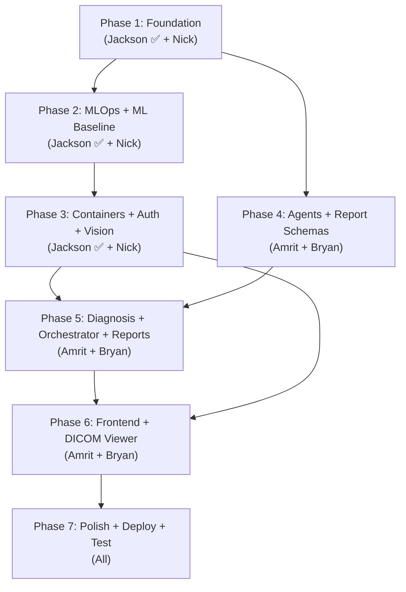

# Radiology Second-Opinion Agent — Full Project Process

> **Team:** The Nguyeners | **Course:** CAI4002 Final Project  
> **Repo:** [radiology-second-opinion-agent](https://github.com/JacksonBopp/radiology-second-opinion-agent)

---

## Team Roles & Responsibilities

| Member | Role | Primary Ownership |
|---|---|---|
| **Jackson Bopp** | Data & MLOps Engineer | Data pipeline, DICOM ingestion, model serving (FastAPI/Celery), MLflow, Evidently drift monitoring, Docker/K8s, CI/CD, auth/audit/feedback |
| **Nicholas Toptchi** | ML Vision Engineer | Anomaly detection (ViT/EfficientNet on CheXpert), localization (U-Net), GradCAM explainability, uncertainty quantification, severity scoring |
| **Bryan Nguyen** | GenAI & NLP Engineer | Structured report generation, clinical language layer, Pydantic schemas, confidence calibration, report quality evaluation |
| **Amrit Ganesh** | Agentic Systems Engineer + Full Stack/Integration | LangGraph orchestrator, Case Retrieval Agent (ChromaDB), Literature Search Agent (PubMed RAG), Differential Diagnosis Agent, React UI (Vite), DICOM viewer (Cornerstone.js), API integration, evaluation dashboard |

> [!NOTE]
> Jackson also supports Amrit on the Full Stack side — auth, audit logging, and feedback capture are already completed by Jackson.

---

## Finalized Technical Decisions

These were locked in during the "Reviewing Implementation Plan Options" conversation and approved by the user:

| Decision | Choice | Rationale |
|---|---|---|
| **Vector Database** | ChromaDB | Local, free, developer-friendly, integrates well with LangChain/LlamaIndex |
| **Agent Framework** | LangGraph | Explicit stateful routing, deterministic, prevents runaway token usage |
| **LLM — Literature Agent** | Gemini 1.5 Flash | Massive context window for reading full medical papers cheaply (~$0.075/1M tokens) |
| **LLM — Retrieval & Diagnosis Agents** | Claude 3 Haiku | Strong reasoning + strict JSON structuring (~$0.25/1M input tokens) |
| **Frontend** | React (Vite) + Cornerstone.js | Separate `frontend/` directory, modern UX, best DICOM viewer integration |
| **Initial Data Strategy** | Mock dummy data | For development/UI testing first, transition to real APIs later |
| **Estimated Cost** | ~$0.006 per analysis | ~160 analyses per $1.00 |

---

## Current Status (as of July 10, 2026)

### ✅ Jackson — Complete (5 commits)
| Commit | Summary |
|---|---|
| `4aac708` | Project setup: README, IDEA.md, team info |
| `62545d2` | DICOM ingestion & preprocessing pipeline |
| `7306f15` | MLflow tracking, FastAPI serving, drift monitoring, Docker/K8s, CI |
| `eb6a08a` | API auth, audit logging, feedback capture |
| `a07f65c` | Summary of work (SUMMARY.md) |

**27 tests passing**, CI green on GitHub Actions.

### 🔲 Not Yet Started
- **Nick** — ML Vision pipeline (anomaly detection, segmentation, GradCAM, severity scoring)
- **Bryan** — GenAI report generation (schemas, prompts, confidence calibration)
- **Amrit** — React frontend + DICOM viewer + evaluation dashboard (Agentic reasoning layer ✅ Done)

---

## Chronological Process — Start to Finish

### Phase 1: Project Foundation & Data Infrastructure *(Weeks 1–2)*

| # | Task | Owner | Status |
|---|---|---|---|
| 1.1 | Create GitHub repo, README, IDEA.md, add collaborators | **Jackson** | ✅ Done |
| 1.2 | Build DICOM ingestion pipeline (loader, preprocessor, metadata extractor, pipeline) | **Jackson** | ✅ Done |
| 1.3 | Write tests for ingestion pipeline | **Jackson** | ✅ Done |
| 1.4 | Set up GitHub Actions CI (`ci.yml`) | **Jackson** | ✅ Done |
| 1.5 | Download & prepare CheXpert + NIH ChestX-ray14 datasets | **Nick** | 🔲 |
| 1.6 | Set up local dev environments, install dependencies | **All** | ✅ Done |
| 1.7 | Set up LangGraph scaffold, define agent state schema | **Amrit** | ✅ Done |

---

### Phase 2: MLOps Layer & ML Model Baseline *(Weeks 3–4)*

| # | Task | Owner | Status |
|---|---|---|---|
| 2.1 | Build MLflow experiment tracking helper (`src/mlops/tracking.py`) | **Jackson** | ✅ Done |
| 2.2 | Build FastAPI serving layer (`/health`, `POST /scans`) | **Jackson** | ✅ Done |
| 2.3 | Build Celery async worker for scan processing | **Jackson** | ✅ Done |
| 2.4 | Build Evidently drift monitoring module | **Jackson** | ✅ Done |
| 2.5 | Fine-tune baseline anomaly detection model (ViT or EfficientNet on CheXpert) | **Nick** | 🔲 |
| 2.6 | Implement multi-label classification head (14 pathology classes) | **Nick** | 🔲 |
| 2.7 | Evaluate baseline against clinical benchmarks (AUC, sensitivity, specificity) | **Nick** | 🔲 |

---

### Phase 3: Containerization, Auth & Vision Model Improvements *(Weeks 5–6)*

| # | Task | Owner | Status |
|---|---|---|---|
| 3.1 | Create Dockerfile + docker-compose.yml | **Jackson** | ✅ Done |
| 3.2 | Create Kubernetes manifests (api, worker, redis, mlflow) | **Jackson** | ✅ Done (YAML-validated, not deploy-tested) |
| 3.3 | Implement API key authentication (`X-API-Key`) | **Jackson** | ✅ Done |
| 3.4 | Build audit trail middleware (SQLite-backed) | **Jackson** | ✅ Done |
| 3.5 | Build radiologist feedback endpoints (`/feedback`) | **Jackson** | ✅ Done |
| 3.6 | Implement uncertainty quantification (MC Dropout / Deep Ensembles) | **Nick** | 🔲 |
| 3.7 | Build localization model (U-Net/nnU-Net for segmentation) | **Nick** | 🔲 |
| 3.8 | Build GradCAM/SHAP explainability overlays | **Nick** | 🔲 |
| 3.9 | Implement severity scoring regression head | **Nick** | 🔲 |

---

### Phase 4: Agentic Reasoning Layer — Case Retrieval & Literature Search *(Weeks 7–8)*

| # | Task | Owner | Status |
|---|---|---|---|
| 4.1 | Build `src/agent/__init__.py` and `vector_store.py` (ChromaDB wrapper + dummy data) | **Amrit** | ✅ Done |
| 4.2 | Build Case Retrieval Agent (`src/agent/retrieval.py`) using Claude 3 Haiku + ChromaDB | **Amrit** | ✅ Done |
| 4.3 | Build similarity ranking by outcome (historical cases → confirmed diagnoses) | **Amrit** | ✅ Done |
| 4.4 | Build Literature Search Agent (`src/agent/literature.py`) with Gemini 1.5 Flash + PubMed API | **Amrit** | ✅ Done |
| 4.5 | Implement RAG pipeline (LlamaIndex) for clinical evidence grounding | **Amrit** | ✅ Done |
| 4.6 | Build clinical guideline extraction (ACR, Fleischner Society criteria) | **Amrit** | ✅ Done |
| 4.7 | Design structured report schemas (Pydantic models) | **Bryan** | ✅ Done |
| 4.8 | Begin prompt engineering for report generation pipeline | **Bryan** | 🔲 |

---

### Phase 5: Differential Diagnosis, Orchestrator & Report Generation *(Weeks 9–10)*

| # | Task | Owner | Status |
|---|---|---|---|
| 5.1 | Build Differential Diagnosis Agent (`src/agent/diagnosis.py`) using Claude 3 Haiku with structured chain-of-thought | **Amrit** | ✅ Done |
| 5.2 | Implement prior probability assignment + Bayesian evidence updating | **Amrit** | ✅ Done |
| 5.3 | Build Orchestrator Agent (`src/agent/orchestrator.py`) — LangGraph state machine | **Amrit** | ✅ Done |
| 5.4 | Handle agent failure modes, retries, fallbacks | **Amrit** | ✅ Done |
| 5.5 | Build analysis API endpoint (`src/api/routes/analysis.py`) — trigger LangGraph workflow | **Amrit** | ✅ Done |
| 5.6 | Modify `src/api/main.py` to register agent routes | **Amrit** | ✅ Done |
| 5.7 | Implement confidence calibration and uncertainty communication | **Bryan** | 🔲 |
| 5.8 | Build report generation pipeline (LLM API + structured prompting) | **Bryan** | 🔲 |
| 5.9 | Implement differential diagnosis ranking in reports | **Bryan** | 🔲 |
| 5.10 | Adapt language model output to radiology report style | **Bryan** | 🔲 |

---

### Phase 6: Frontend, DICOM Viewer & Integration *(Weeks 11–12)*

| # | Task | Owner | Depends On |
|---|---|---|---|
| 6.1 | Scaffold React app with Vite (`frontend/` directory) | **Amrit** | 5.5 |
| 6.2 | Build authentication UI (API key input for `X-API-Key`) | **Amrit** | 6.1, 3.3 |
| 6.3 | Build scan upload + analysis trigger page | **Amrit** | 6.1, 5.5 |
| 6.4 | Implement DICOM viewer with Cornerstone.js | **Amrit** | 6.1 |
| 6.5 | Integrate GradCAM heatmap overlay into DICOM viewer | **Amrit** | 6.4, 3.8 (Nick's GradCAM) |
| 6.6 | Build report viewing interface | **Amrit** | 6.1, 5.8 |
| 6.7 | Build radiologist feedback UI (correction capture) | **Amrit** + **Jackson** | 6.1, 3.5 |
| 6.8 | Build evaluation dashboard (model performance + report quality metrics) | **Amrit** | 6.1 |
| 6.9 | Evaluate report quality against real radiologist reports | **Bryan** | 5.8 |
| 6.10 | Extract and display clinical guideline references in reports | **Bryan** | 4.6, 5.8 |

---

### Phase 7: Polish, Testing & Deployment *(Weeks 13–14)*

| # | Task | Owner | Status |
|---|---|---|---|
| 7.1 | Write unit tests for agents (mocking LLM/ChromaDB) (`tests/test_agents.py`) | **Amrit** | ✅ Done |
| 7.2 | End-to-end integration testing (scan upload → agent pipeline → report) | **All** | 🔲 |
| 7.3 | Build & deploy-test Docker containers | **Jackson** | 🔲 |
| 7.4 | Deploy to Kubernetes cluster (if available) | **Jackson** | 🔲 |
| 7.5 | Activate MLflow model registry with Nick's trained models | **Jackson** | 🔲 |
| 7.6 | Activate Evidently drift monitoring with real prediction data | **Jackson** | 🔲 |
| 7.7 | Final model evaluation against CheXpert benchmarks | **Nick** | 🔲 |
| 7.8 | Final report quality evaluation (clinical accuracy, completeness) | **Bryan** | 🔲 |
| 7.9 | UI/UX polish, responsive design, error handling | **Amrit** | 🔲 |
| 7.10 | Comprehensive documentation and README update | **All** | 🔲 |
| 7.11 | Prepare presentation / demo | **All** | 🔲 |

---

## Dependency Flow

> [!IMPORTANT]
> **Critical Dependencies:**
> - Amrit's agent layer (Phase 4–5) can start **immediately** using **mock/dummy data** — no need to wait for Nick's ML models.
> - Bryan's report generation (Phase 5) needs the agent pipeline's differential diagnosis output + Nick's model confidence scores for meaningful reports.
> - The DICOM viewer GradCAM overlay (Phase 6) requires Nick's explainability outputs.
> - Jackson's deploy testing (Phase 7) requires all components to be code-complete.
> - The approved plan uses **mock data first → real APIs later**, so Amrit and Bryan can work in parallel with Nick.

---

## Work Distribution Summary

| Member | Phases Active | Status | Total Tasks |
|---|---|---|---|
| **Jackson Bopp** | 1–3 ✅, 6 (support), 7 | **~100% of his scope done** | 14 done, 4 remaining |
| **Nicholas Toptchi** | 1–3, 7 | **0% started** 🔲 | 0 done, 10 remaining |
| **Bryan Nguyen** | 4–7 | **~10% started** 🔲 | 1 done, 7 remaining |
| **Amrit Ganesh** | 1, 4–7 (heaviest) | **~50% started** (Backend Done) ✅ | ~14 done, 11 remaining |

> [!WARNING]
> **Amrit carries the heaviest workload** with 24+ tasks spanning both the agentic reasoning layer (4 sub-agents + orchestrator) AND the entire frontend/integration stack (React app, DICOM viewer, evaluation dashboard, API routes). 
> *Update: The backend Agentic Reasoning Layer (Phases 4 & 5) is now complete.*

---

## Immediate Next Steps (for Amrit)

With the backend fully built and tested, start with **Phase 6: Frontend, DICOM Viewer & Integration**:

1. Scaffold React app with Vite (`frontend/` directory).
2. Build authentication UI (API key input).
3. Build scan upload + analysis trigger page.
4. Implement DICOM viewer with Cornerstone.js.
5. Build report viewing interface.
